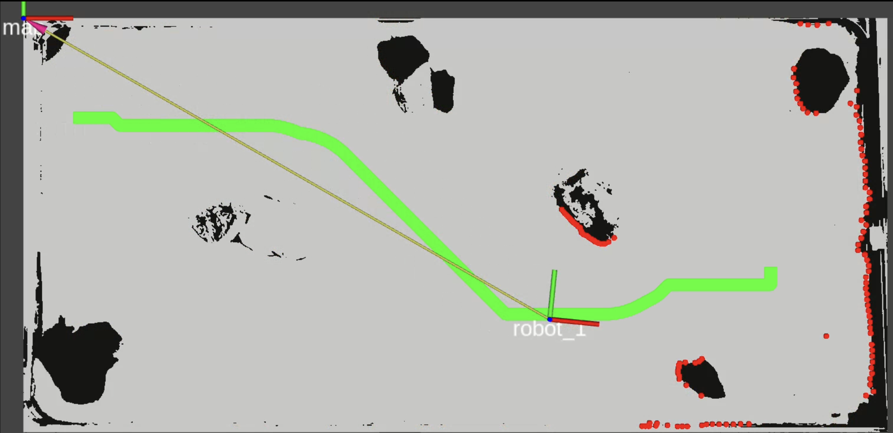
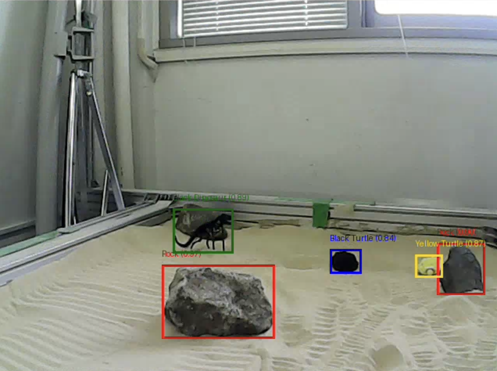

# 🤖 MoonBot Navigation 🌕

**Copyright © 2025 Alessio Borgi, Andre Khoo, Kristjan Tarantelli, Rasmus Börjesson Dahlstedt**

---
**Certificate of Excellence: 1st Place in the TESP 2025 Competition**

---
**Robot Navigation, Obstacle Avoidance and Interaction on the Moon**

This project aims to design, build, and program an autonomous mobile robot capable of navigating a static sand terrain, simulating lunar conditions, and interacting with objects in its environment. 

> A Space Robotics Lab project under Prof. K. Yoshida, Tohoku University  
---

## 🚀 Project Overview

Our task was to design and build an autonomous mobile robot capable of navigating a simulated lunar environment, avoiding obstacles, and interacting with specific target objects placed on the terrain.

This mission required overcoming several key challenges. First, we had to build the robot entirely from scratch, optimizing its mechanical design for a sandy, uneven surface that caused slippage and instability. This meant carefully selecting components, configuring the drivetrain, and iteratively refining the robot’s physical structure.

The second major challenge was to implement a robust navigation and control system. This involved generating reliable paths through the terrain—despite limited sensor data and unpredictable motion—and finally enabling the robot to detect and interact with objects (turtles) using onboard vision and a custom-built gripper.

  

### 👇 Real Task (Storyline) 😄
> The Koopas are stranded on the Moon, in the domain of Dry-Bowser. With Mario on holiday with Peach, it's up to **R.O.B.** to rescue them by navigating lunar terrain and interacting with targets (Turtles).

  <table>
    <tr>
      <td>
        
      </td>
      <td>
        
      </td>
    </tr>
  </table>

---

## 🛠️ Hardware Architecture

### 🤖 Robot Evolution
We iteratively prototyped 4 robot models, each improving on mobility, power, and design stability:
- **Tsukikage**: Lightweight, 2 motors, simple
- **Seigetsu**: 4 motors, powerful but heavy
- **Mikazuki**: Compact turning, unstable front
- **Tenshiko (Final)**: Loader-inspired, 1 motor linear gripper

The final robot is the following: 

  <table>
    <tr>
      <td>
        
      </td>
      <td>
        
      </td>
    </tr>
  </table>

### 🧠 Electronics Stack
- **Raspberry Pi** — Sensor & ML processing
- **EV3 Brick** — Motor control
- **Camera Module** — Turtle detection
- **Motors** — Controlled via ROS2 or manually

---

## 📡 Software Architecture

### 🧭 Path Planning (ROS2 Simulator)
- **Input**: Binary Map (simulated satellite view)
- **Planner**: Dijkstra Algorithm (suboptimal/fallback pathing)
- **Controller**: PD controller outputs velocity `(v)` and angular velocity `(w)`
- **Visualization**: RViz

To enable autonomous navigation, we developed a computer vision and planning pipeline that converts a raw image of the terrain into a structured navigation map used by our path planner.

###### Capture from Satellite
A top-down image of the terrain is acquired, simulating satellite imagery of a lunar environment with sand and rocks.

###### Binary Map Generation 
The image is converted into a binary map using basic thresholding. Obstacles appear in black, and free space appears in white—simplifying the environment for planning algorithms.

  

###### Distance Map Calculation & Retraction Algorithm 
Using the binary map, a distance transform is applied to compute a distance map. This map indicates how far each point is from the nearest obstacle. Brighter regions are safer and more navigable. Finally, we apply a retraction process on the distance map to generate a safe navigation zone, pulling the valid path away from obstacles while preserving reachability. This map serves as the input for our Dijkstra-based path planner.

  

##### SLAM On the MOON
 

  <a href="https://www.youtube.com/watch?v=3jToJo4PlYQ">
    
Click the Photo to See the Video!

    
  </a>

---

## 🧠 Machine Learning for Object Detection

- **Camera**: GC0308 CMOS, 2MP, 30FPS
- **Dataset**: 240 labeled images (manual masks)
- **Platform**: Roboflow for data augmentation + training
- **Model**: Simple object detection used for turtle identification and aimpoint guidance
- **Issues**: Blurry images → failed detections

 

  <a href="https://www.youtube.com/watch?v=YZeRK4v5kP4">
    
Click the Photo to See the Video!

    
  </a>

---

## 🎮 Navigation & Object Interaction

### Short-Range Tracking
- Use visual servoing to keep turtle centered in view.
- Simple heuristic-based steering.

### Gripper Mechanism
- Loader-style linear gripper (must stay off ground while navigating).
- Difficulty aligning due to nondeterministic slip/glide on sand.

---

## 👥 Team

| Name                         | Affiliation                                | Country |
|------------------------------|---------------------------------------------|---------|
| Andre Khoo                  | Nanyang Technological University            | 🇸🇬 Singapore |
| Alessio Borgi               | Sapienza University of Rome (AI & Robotics) | 🇮🇹 Italy |
| Kristjan Jurij Tarantelli   | Sapienza University of Rome (AI & Robotics) | 🇮🇹 Italy |
| Rasmus Börjesson Dahlstedt | Chalmers University of Technology           | 🇸🇪 Sweden |

---
